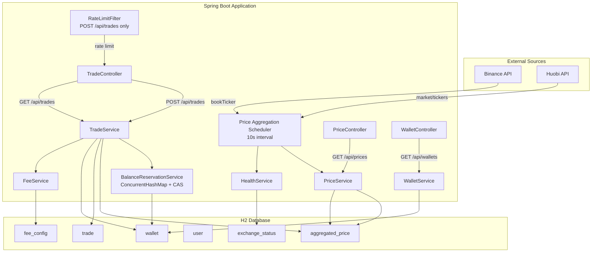
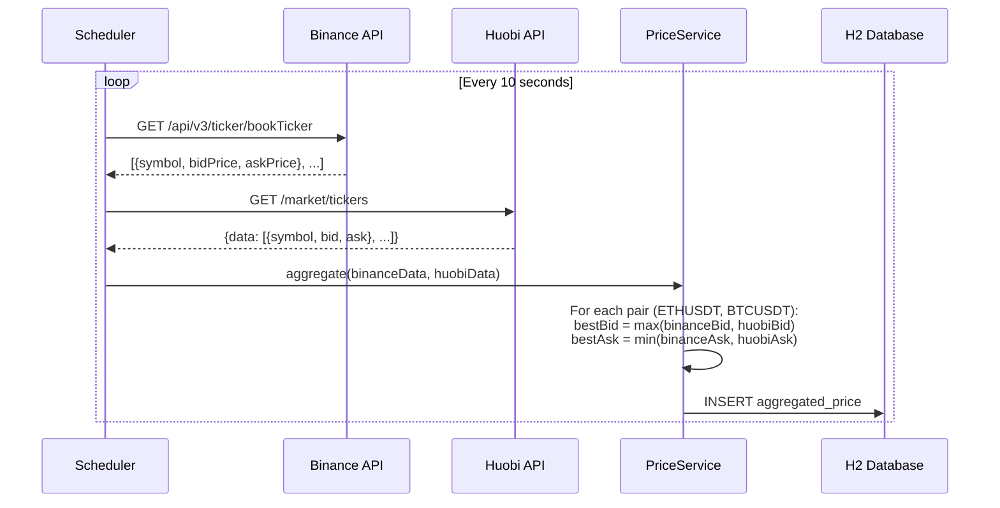
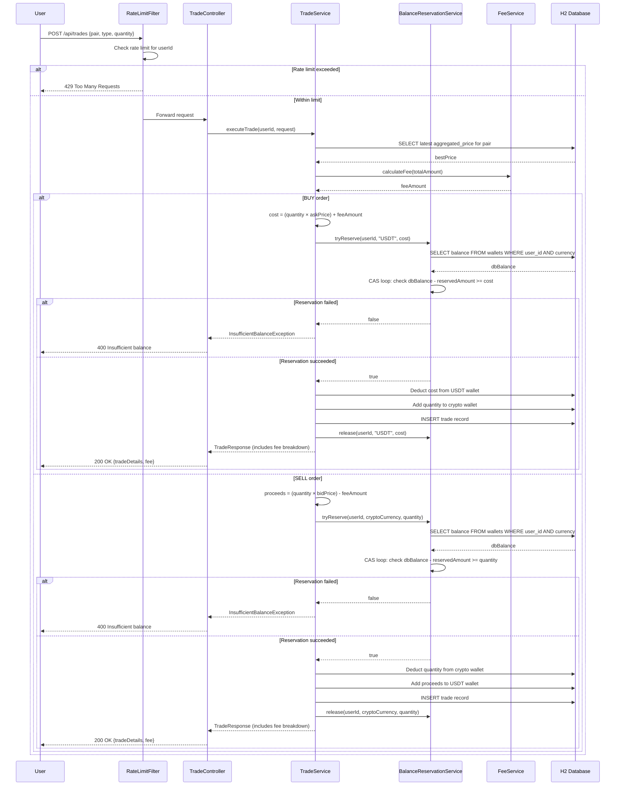
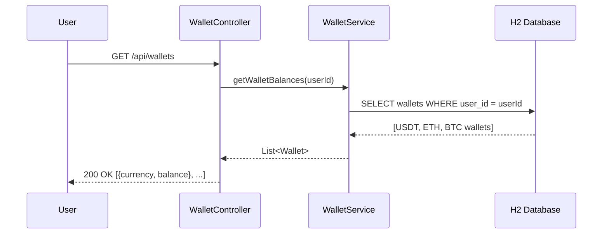
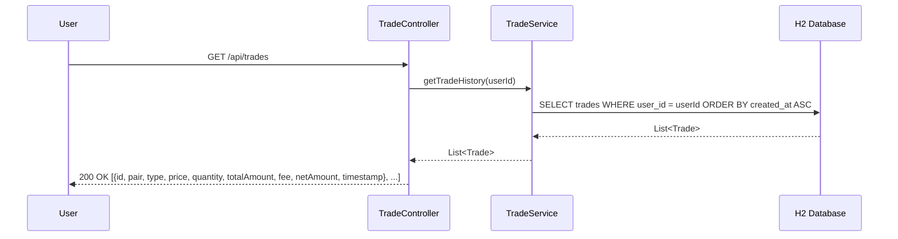
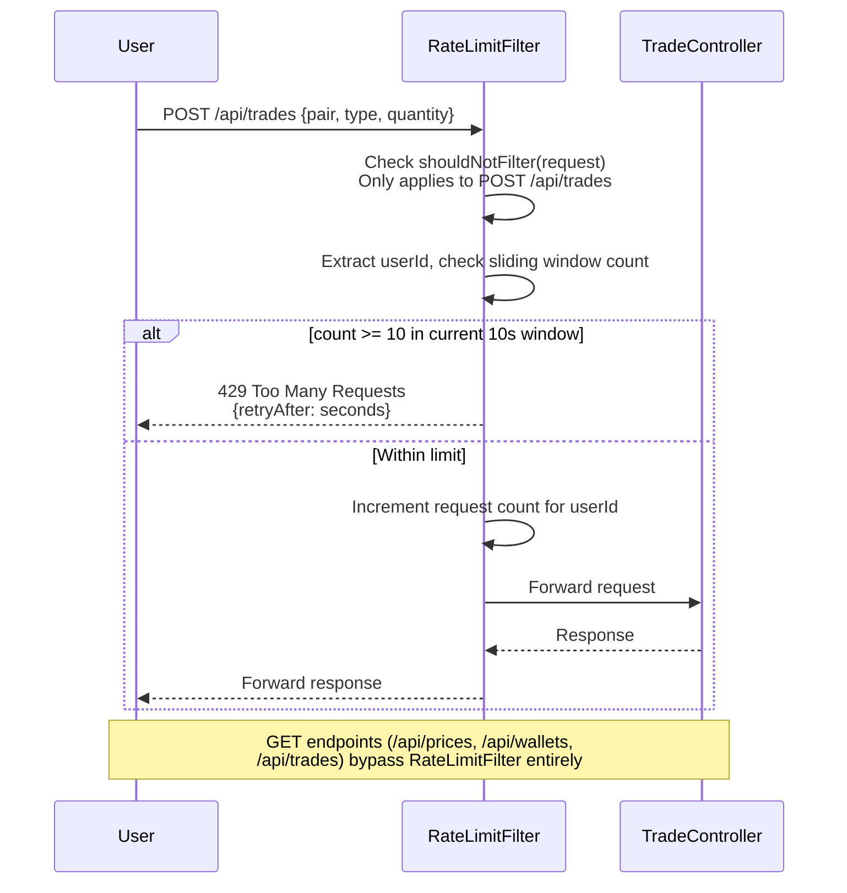

# Design Document: Crypto Trading System

## Overview

This system is a Spring Boot-based crypto trading platform that aggregates real-time pricing from Binance and Huobi exchanges, determines the best bid/ask prices for ETHUSDT and BTCUSDT trading pairs, and exposes REST APIs for trading, wallet balance inquiry, and transaction history. An in-memory H2 database stores all persistent state including user wallets, aggregated prices, and trade history.

The system operates under the assumption that users are pre-authenticated and start with an initial USDT balance of 50,000. A scheduled task runs every 10 seconds to fetch and aggregate pricing from external sources, storing only the best prices. Trading is executed against these aggregated prices without integration to any third-party order execution system.

## Architecture

## Sequence Diagrams

### Price Aggregation Flow

### Trade Execution Flow (with Balance Reservation and Fee Calculation)

### Wallet Balance Retrieval Flow

### Trading History Retrieval Flow

### Rate Limiting Flow

